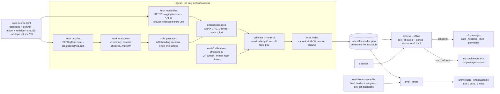

# Architecture — Aveto Support

> Owned by the Architect. This file describes the system **as it stands now**, and
> is updated each slice rather than appended to. The history of *why* lives in
> [`docs/adr/`](adr/). Per-slice detail lives in `runs/<slice-id>/`.
>
> **Current as of:** docs-retrieval-core, retrieval **variant embed-v3** (hybrid:
> a local embedding model fused with BM25). It is accepted in
> [ADR 0003](adr/0003-hybrid-embedding-retrieval.md) and **implementation is
> pending**. The code in the repo is still v1. This file describes the design
> being built.
> Tech spec: `runs/docs-retrieval/02-tech-spec.md`, section "Retrieval — variant embed-v3".

## What exists

Aveto Support will be a support agent that drafts grounded replies to GitHub
issues and Discussions from a product's own docs, and never posts without a
person's approval. Today, only **step 2 of the pipeline, retrieval, exists**, as a
command-line tool. It has no server and no database.

It uses **one local, non-generative model**, a small embedding model that runs
on the CPU. The model ranks passages and decides confidence, and it never
writes text.

```
                    ┌──────────────── today (docs-retrieval-core) ────────────────┐
question ─► [1 classify] ─►│ [2 retrieve] ─► RetrievalResult (≤5 passages | no confident match) │─► [3 draft] ─► [4 check] ─► [5 person approves] ─► post
             not built     └──────────────────────────────────────────────────────────────┘    not built     not built      not built
```

## Components

| Component | Module | Responsibility |
|-----------|--------|----------------|
| CLI | `aveto_support/__main__.py` | `ingest`, `retrieve` and `eval` subcommands, and the exit codes. It pins numeric libraries to one thread for determinism and has no logic of its own |
| Ingest | `aveto_support/ingest.py` | **All network code.** Fetches the pinned GitHub docs archive and the pinned model files, verifies the archive commit and every model file's sha256 **before use**, reads `.md` files in memory, and orchestrates index building |
| Index | `aveto_support/index.py` | Splits markdown into heading passages with exact line ranges, and serialises and loads the canonical JSON index (`index@3`: passages plus int8 embeddings) |
| Embed | `aveto_support/embed.py` | **The model adapter boundary.** The `Embedder` protocol; `OnnxEmbedder` (`BAAI/bge-small-en-v1.5` at revision `5c38ec7c…`, ONNX Runtime on CPU); `PlaceholderEmbedder`, which throws by default; plain-Python WordPiece; int8 quantisation |
| Search | `aveto_support/search.py` | Lexical ranking (v2: Porter stemming, passage + file BM25), dense ranking, Reciprocal Rank Fusion, dense-confidence calibration, and `retrieve()` |
| Rerank | `aveto_support/rerank.py` | **The second model adapter boundary, optional.** `OnnxReranker` (`cross-encoder/ms-marco-MiniLM-L6-v2`, pinned revision and sha256s, ONNX Runtime on CPU) returns one float per question/passage pair and never text; `PlaceholderReranker` throws by default. It is used only with `--ranking file-rerank-v1`; absent files fail closed (exit 2), nothing is downloaded by `retrieve` or `eval` |
| Evaluate | `aveto_support/evaluate.py` | Scores retrieval against an eval file (`--eval-file`) using integer ≥80% thresholds |

**Configuration** lives in `docs-source.toml`: the docs repo and its full
40-hex commit, plus an `[embedding]` table holding the model repo, revision and
per-file sha256, and the path and sha256 of the frozen off-topic calibration
list.

**Generated and gitignored:** the index at `index/docs-index.json`, and the
model cache at `models/BAAI--bge-small-en-v1.5/<revision>/`.

**Committed eval and calibration inputs:**

- `evals/retrieval.toml`, the dev-set diagnostic
- `evals/calibration-offtopic.toml`, written by QA, frozen and pinned by sha256,
  and never read by the roles that build retrieval
- the owner's fresh held-out set, which gates the ≥80% bar and is committed
  only after the implementation is frozen

**Ranking modes and model lifetime (slice docs-retrieval-4).** The default ranking is
`file-rrf-v1`, the first stage alone, which needs only the embedding model.
`--ranking file-rerank-v1` re-scores its top 20 files with the reranker and needs
`ingest --with-reranker` first; by default `ingest` fetches only the embedding model's
files, so the default path loads no reranker file. The index is byte-identical either way.
Whoever loads an ONNX adapter closes it (`close()`, reranker before embedder) in a
`finally` before the process ends, so no inference session is left to interpreter
teardown; adapters injected by a caller are the caller's to close.

## Data flow



1. **`ingest`** makes the only two network requests.
   - It fetches the docs archive (`https://github.com/{repo}/archive/{commit}.tar.gz`,
     with redirects only to `codeload.github.com`) and never extracts it to
     disk.
   - It fetches two model files (`onnx/model.onnx`, `vocab.txt`) from
     `https://huggingface.co/BAAI/bge-small-en-v1.5/resolve/<revision>/…`, with
     redirects only to hosts under `hf.co`. Each file is hashed while it
     streams. On a mismatch it is deleted and ingest fails (exit 3). A cached
     file is re-hashed before every use.
   - It splits `.md` files at their ATX headings and embeds each passage (heading
     trail plus body, truncated to 512 tokens). It calibrates τ from word-salad
     nulls and from the frozen off-topic list, taking the stricter of the two,
     then writes the index atomically.
2. **`retrieve`** is **fully offline**. It embeds the question locally with
   bge's retrieval prefix, then ranks passages by Reciprocal Rank Fusion of the
   lexical list and the dense list, with at most 2 passages per file and 5 in
   total. It is confident only if the best dense similarity in the docs is at
   least τ. Then it returns up to 5 verbatim passages, each with path, heading,
   line range and permalink. Otherwise it returns exactly `no confident match`
   and **no** passages.
3. **`eval`** is fully offline. It runs every question in the given file through
   `retrieve`, prints both scores, and exits 1 if either is below 80%.

The reasoning is in [ADR 0003](adr/0003-hybrid-embedding-retrieval.md), which
supersedes the ranking and confidence parts of
[ADR 0002](adr/0002-lexical-retrieval-calibrated-abstention.md).

## Model adapter boundaries

- **Embedding (retrieval, step 2): real and local.** `Embedder` is a
  `Protocol`. `PlaceholderEmbedder` raises `"embedding model is not configured
  in this build."` and is the default wherever a model was not explicitly
  loaded. Unit tests use a deterministic `FakeEmbedder`, so they need no model,
  no network and no key. `OnnxEmbedder` loads only hash-verified files from the
  local cache, and **nothing it computes is ever shown as text**.
- **Generative steps: not built.** Each will sit behind a `Protocol` with a
  placeholder that raises `"<capability> LLM adapter is not configured in this
  build."` ([ADR 0001](adr/0001-python-fastapi-uv-no-agent-framework.md)):
  - **Classify (step 1)** runs *before* `retrieve()`, with rules first.
  - **Draft (step 3)** consumes `RetrievalResult` unchanged. If there is no
    confident match, it escalates. Its bounded tool loop searches by calling
    `retrieve()`.
  - **Check (step 4)** uses a different model from the drafter.
- **FastAPI** routes, once an HTTP surface is needed, wrap the same service
  functions.

## Safety stance (this slice)

- **Sources, never answers (INV-4).** Retrieval returns only verbatim passages,
  or "no confident match" with none. A model may **only** rank passages and
  decide confidence. It never produces, selects fragments of, or alters the
  text returned.
- **Provenance is always visible.** A passage can only be printed together with
  its path, heading, line range and commit permalink.
- **Grounded or silent.** Below the calibrated threshold, nothing is shown, not
  even the closest candidate.
- **Bounded network surface (INV-5, amended under APPROVAL_RECORD-4).** Egress
  is limited to two read-only HTTPS GETs, both made only by `ingest`:
  - the configured docs archive at a full commit (redirects only to GitHub
    hosts), approved under APPROVAL_RECORD-1
  - the pinned model files at a full revision from `huggingface.co` (redirects
    only to `*.hf.co`), approved under APPROVAL_RECORD-3

  Trust rests on the committed sha256, checked before use, never on the host.
  No credentials are sent. **No question, passage or user text ever leaves the
  machine.** `retrieve`, `eval` and the default test suite make no network
  calls, and tests block the network by default.
- **Nothing posts.** There is no GitHub write client and no credential of any
  kind (INV-1).

## How CI invokes it (built by docs-retrieval-ci)

Each of these runs as its own step, and any non-zero exit fails the build:

```sh
uv sync --locked
uv run mypy
uv run ruff check
uv run pytest                                         # offline suite
uv run python -m aveto_support ingest                 # docs + model download; exit 3 on fetch or hash failure
uv run pytest -m model                                # golden tokenizer ids, ONNX signature, repeatability
uv run python -m aveto_support eval --eval-file <gating set>   # exit 1 if either group < 80%
```

The model cache (`models/`) should be restored with `actions/cache`, keyed on the
revision and the file hashes. Cached files are still re-hashed before use. The
score is printed on the `eval` step's stdout, and CI gates on the **exit code**.

## Decisions

- [ADR 0001](adr/0001-python-fastapi-uv-no-agent-framework.md): Python 3.12 +
  uv, FastAPI for HTTP when needed, Anthropic SDK direct, no agent framework.
  *Accepted.*
- [ADR 0002](adr/0002-lexical-retrieval-calibrated-abstention.md): BM25 over
  heading passages with calibrated abstention. *Proposed; its ranking and
  confidence are superseded by 0003.* Lexical v2 remains the specified
  fallback.
- [ADR 0003](adr/0003-hybrid-embedding-retrieval.md): hybrid retrieval with a
  local `bge-small-en-v1.5` (ONNX/CPU) fused with BM25, and dense confidence.
  *Accepted, implementation pending.*
