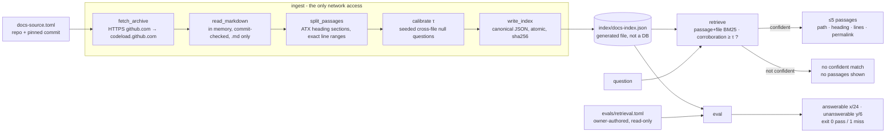

# Architecture — Aveto Support

> Owned by the Architect. This file describes the system **as it stands now**, and
> is updated each slice rather than appended to. The history of *why* lives in
> [`docs/adr/`](adr/). Per-slice detail lives in `runs/<slice-id>/`.
>
> **Current as of:** docs-retrieval-core, retrieval **variant v2** (specified for
> retry 1 and being re-implemented; v1 missed the eval bar, see ADR 0002
> "Revision 1").
> Tech spec: `runs/docs-retrieval/02-tech-spec.md`.

## What exists

Aveto Support will be a support agent that drafts grounded replies to GitHub
issues and Discussions from a product's own docs, and never posts without a
person's approval. Today, only **step 2 of the pipeline, retrieval, exists**, as a
command-line tool with no model, no server, no database and no runtime
dependencies.

```
                    ┌──────────────── today (docs-retrieval-core) ────────────────┐
question ─► [1 classify] ─►│ [2 retrieve] ─► RetrievalResult (≤5 passages | no confident match) │─► [3 draft] ─► [4 check] ─► [5 person approves] ─► post
             not built     └──────────────────────────────────────────────────────────────┘    not built     not built      not built
```

## Components

| Component | Module | Responsibility |
|-----------|--------|----------------|
| CLI | `aveto_support/__main__.py` | `ingest`, `retrieve` and `eval` subcommands, and the exit codes. It has no logic of its own |
| Ingest | `aveto_support/ingest.py` | Reads `docs-source.toml` and fetches the pinned GitHub archive. **This is the only network code.** It reads `.md` files in memory, verifies the archive is for the pinned commit, and orchestrates index building |
| Index | `aveto_support/index.py` | Splits markdown into heading passages with exact line ranges, and serialises and loads the canonical JSON index |
| Search | `aveto_support/search.py` | Tokenizer (NLTK stopwords, Porter 1980 stemmer), ranking-v2 (passage BM25 combined equally with file BM25), the corroboration confidence signal, corpus calibration of the threshold, and `retrieve()` |
| Evaluate | `aveto_support/evaluate.py` | Scores retrieval against `evals/retrieval.toml`, which is owner-authored and read-only, using integer ≥80% thresholds |

Configuration lives in `docs-source.toml` (the repo and its full 40-hex commit).
The generated index is `index/docs-index.json`, which is gitignored and never
committed.

## Data flow



1. **`ingest`** fetches one archive (`https://github.com/{repo}/archive/{commit}.tar.gz`,
   which may redirect only to `codeload.github.com`). It never extracts to disk.
   It keeps `.md` regular files and splits each one at its ATX headings (ignoring
   headings in code fences and front matter). It calibrates the confidence
   threshold τ from the corpus, then writes the index atomically. Running it
   twice on the same commit gives byte-identical output, with the sha256 printed.
2. **`retrieve`** scores each passage that shares at least one word with the
   question. The score is half passage BM25 and half file BM25, each normalised
   to the best candidate; the passage counts its heading trail twice and its
   file path once. A file contributes at most 2 of the top 5. Confidence is
   **corroboration**: the idf mass of the question's words that the top passage
   contains, minus the single strongest one, so a lone shared keyword scores 0.
   At or above τ it returns up to 5 passages,
   each with path, heading, line range and a permalink. Below τ it returns
   exactly `no confident match` and **no** passages.
3. **`eval`** runs every question in `evals/retrieval.toml` through `retrieve`.
   An answerable question needs a listed source among the returned passages, and
   an unanswerable one needs `no confident match`. It prints both scores and
   exits 1 if either is below 80%.

The reasoning behind the method is in
[ADR 0002](adr/0002-lexical-retrieval-calibrated-abstention.md).

## Model adapter boundaries

**No model is called anywhere, and no model adapter exists yet.** Everything
above is deterministic plain code.

When model steps arrive, each one sits behind a Python `Protocol` with a
placeholder that raises `"<capability> LLM adapter is not configured in this
build."` by default, so tests never need a key
([ADR 0001](adr/0001-python-fastapi-uv-no-agent-framework.md)):

- **Classify (step 1)** runs *before* `retrieve()`, with rules first and a model
  only as a fallback.
- **Draft (step 3)** consumes `RetrievalResult` unchanged. If there is no
  confident match, it escalates rather than drafting. Its bounded tool loop
  searches by calling `retrieve()`.
- **Check (step 4)** compares the draft against the cited `Passage.text`, using a
  different model from the drafter.
- **FastAPI** routes, once an HTTP surface is needed, wrap the same service
  functions and hold no retrieval or safety logic.

## Safety stance (this slice)

- **Sources, never answers.** Retrieval outputs verbatim passage excerpts under
  "Sources", and ends with "These are sources, not an answer." It never generates,
  summarises or rewords anything.
- **Provenance is always visible.** A passage can only be printed together with
  its path, heading, line range and commit permalink.
- **Grounded or silent.** Below the calibrated threshold, nothing is shown, not
  even the closest candidate.
- **One network path.** The only egress is the HTTPS archive fetch of the
  configured repo at a full commit SHA. Redirects go only to GitHub hosts, and no
  credentials are sent. Tests block the network by default. The owner approved
  this fetch for `gpatwa/agentic-sdlc-playbook` at the pinned commit (rule 5,
  `runs/docs-retrieval/APPROVAL_RECORD-1.md`). Pointing this repo at another
  source is a new approval.
- **Nothing posts.** There is no GitHub write client and no credential of any
  kind (INV-1).

## How CI invokes it (built by docs-retrieval-ci)

Each of these runs as its own step, and any non-zero exit fails the build:

```sh
uv sync --locked
uv run mypy
uv run ruff check
uv run pytest
uv run python -m aveto_support ingest    # exit 3 on fetch failure
uv run python -m aveto_support eval      # exit 1 if answerable < 80% or unanswerable < 80%
```

The score is printed on the `eval` step's stdout: the `answerable:` and
`unanswerable:` lines, and a final `eval: PASS|FAIL`. CI gates on the **exit
code** and does not parse the numbers, so the threshold lives only in
`aveto_support/evaluate.py`.

## Decisions

- [ADR 0001](adr/0001-python-fastapi-uv-no-agent-framework.md): Python 3.12 +
  uv, FastAPI for HTTP when needed, Anthropic SDK direct, no agent framework.
  *Accepted.*
- [ADR 0002](adr/0002-lexical-retrieval-calibrated-abstention.md): BM25 over
  heading passages, with a corpus-calibrated "no confident match". *Proposed
  until the Release Gate.*
- *Pending, not decided:* a hybrid embeddings variant (`embed-v3`, local
  `BAAI/bge-small-en-v1.5` via ONNX Runtime). It is designed in
  `runs/docs-retrieval/02-tech-spec.md` for the owner to approve or reject. It
  would change INV-5 and the intent's "no model" lines. None of it is built or
  installed. If approved, it gets ADR 0003.
